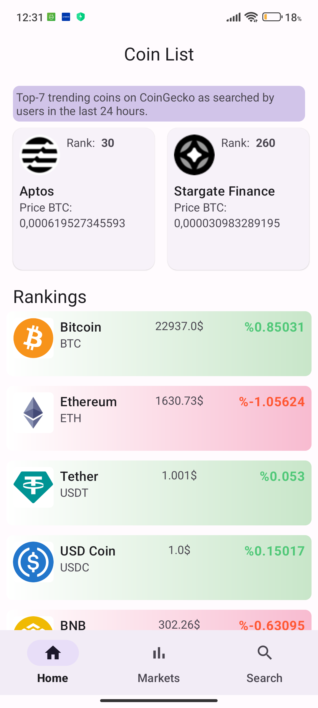
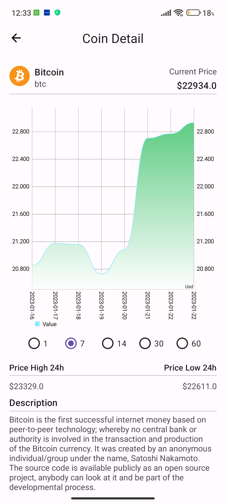
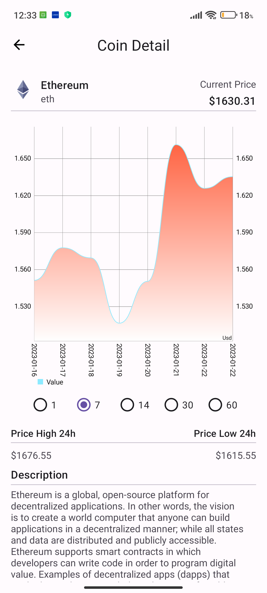
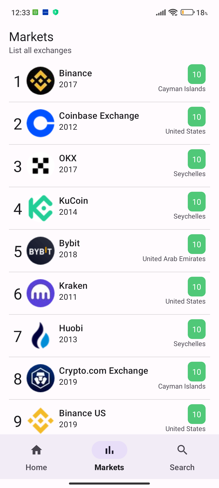
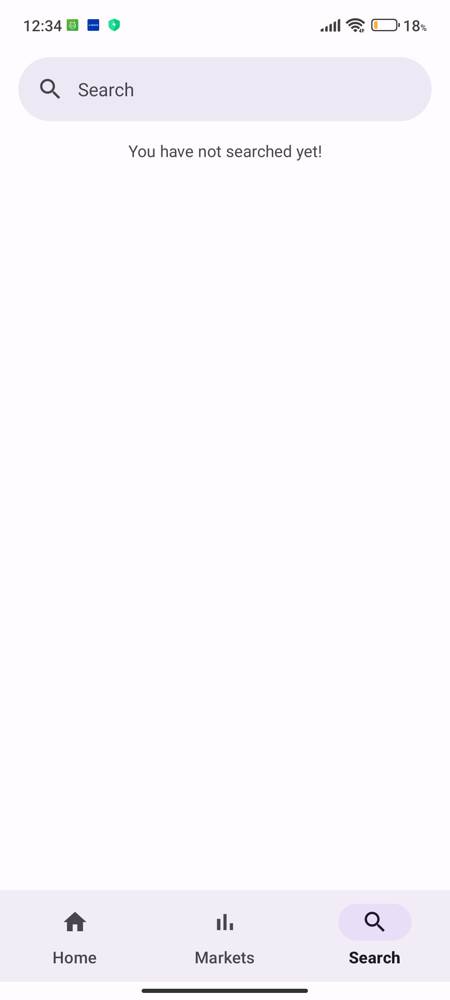
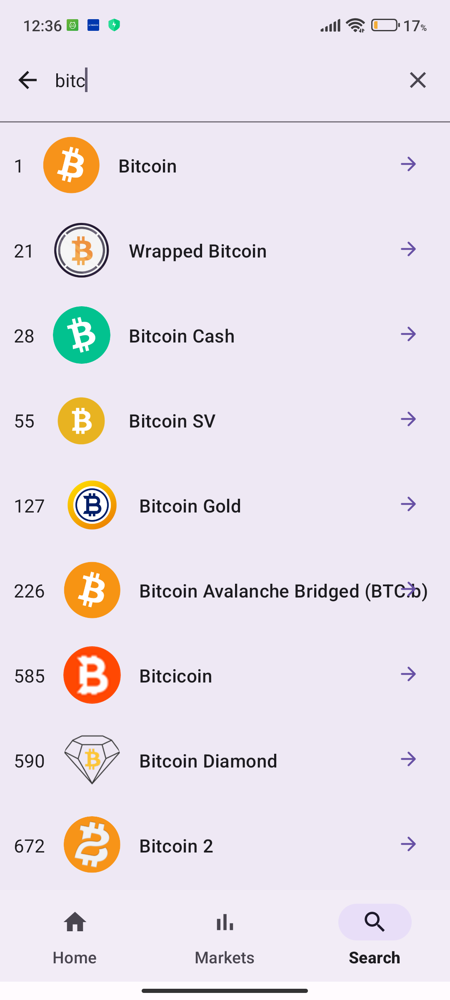

# Crypto-app
This is a crypto-tracker app. You can see crypto's status with line chart (Last 1-7-14-30-60 days). You can search coin by it's name.  I used CoinGecko's API. Coroutines-Flows, Hilt, Retrofit...

* MVVM - ViewModel
* Jetpack Navigation
* Retrofit2 - Network calling (GET Requests)
* OkHttp-3 Logging interceptor
* Dagger-Hilt for Dependency injection
* <a href="https://coil-kt.github.io/coil/"> Coil for image loading </a>
* Swipe refresh layout in coin-list screen
* <a href="https://github.com/PhilJay/MPAndroidChart"> MPAndroid Chart </a>
* Coroutines-Flows
* ViewBinding and DataBinding
* <a href="https://developer.android.com/topic/libraries/data-binding/binding-adapters"> Binding Adapters </a>

| Coin-List       | Coin-Detail-1           | Coin-Detail-2  |
| ------------- |:-------------:| -----:|
|  </img>      |  </img> | </img> |

| Markets        | Search-1           | Search-2  |
| ------------- |:-------------:| -----:|
| </img>      |  </img> |  </img> |

## Video
https://user-images.githubusercontent.com/67907559/213910098-c377968b-e89b-4656-bb01-3f747548bcc0.mp4

